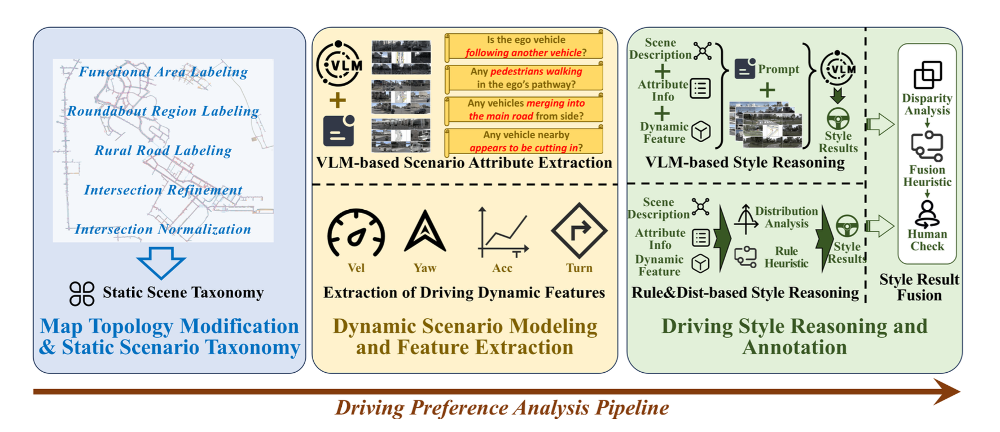








I am a Master’s graduate in Artificial Intelligence from the University of Manchester, with a deep passion for building intelligent systems that learn, perceive, and act in the real world. My research bridges **deep learning**, **generative modeling**, and **autonomous systems**, with a focus on enabling robust, interpretable, and generalizable AI agents.

My long-term goal is to develop autonomous agents capable of *accurate perception*, *goal-directed decision making*, and *continual learning* in complex, uncertain environments. In particular, I am fascinated by **diffusion models**, **vision-language systems**, and **embodied intelligence**. I believe these are key ingredients for the next generation of interactive AI systems.

I have hands-on experience in:
- End-to-end autonomous driving and personalized trajectory generation;
- Multimodal learning (vision, language, control);
- Video generation, GNNs, reinforcement learning, and real-world dataset curation.

Currently, I am seeking a PhD position in the UK or globally where I can explore the intersection of **generative models**, **robotics**, and **embodied cognition**.

> If you're building the future of grounded, generative, and human-aligned AI — let’s connect.

[Google Scholar](https://scholar.google.com/) • [GitHub](https://github.com/) • [LinkedIn](https://linkedin.com/)

# 🔥 News
- *2025.07*: &nbsp;🚀 Our paper **"StyleDrive: Towards Driving-Style Aware Benchmarking of End-to-End Autonomous Driving"** is now on arXiv! [Read here](https://arxiv.org/abs/2506.23982)
- *2025.06*: &nbsp;🎉 I received a Distinction (85%) for my Master's final project on comparative analysis of Deep Learning vs Traditional CV in robotic perception, ranking top 10% in class.

# 📝 Publications 

Course Project 2024

[**Comparative Analysis of Deep Learning and Traditional Computer Vision in Robotic Vision**](https://drive.google.com/file/d/12L-lZoBxPLFMu5bqIUWveo-UyAP-Q3OF/view?usp=sharing)  
**Bowen Jing**

[**Project Report**](https://drive.google.com/file/d/12L-lZoBxPLFMu5bqIUWveo-UyAP-Q3OF/view?usp=sharing)  
- Achieved 85%, analyzed robustness and generalization of ResNet, ViT, and BoVW under different noise levels.
- Contributed experimental datasets and comparative benchmarks.

Course Project 2024

[**Sentence-Level Relation Extraction with Transformer-based and GCN Models**](https://drive.google.com/file/d/1-8UGvDrBVcWMseC0Id7IasmWdYwvWMUk/view?usp=sharing)  
**Bowen Jing**

[**Project Report**](https://drive.google.com/file/d/1-8UGvDrBVcWMseC0Id7IasmWdYwvWMUk/view?usp=sharing)  
- Reached 92.75%, top 5 in class. Benchmarked PA-LSTM, C-GCN, BERT/RoBERTa on TACRED, TACREV, and Re-TACRED.
- Designed custom entity marker and contributed few-shot + length-variant splits for robustness testing.

Course Project 2024

[**End-to-End Autonomous Driving System with Middle Fusion and Attention**](https://drive.google.com/file/d/1th9M1kdggCL_x-zmeAltJgVP9Lmgc4fn/view?usp=sharing)  
**Bowen Jing**

[**Project Report**](https://drive.google.com/file/d/1th9M1kdggCL_x-zmeAltJgVP9Lmgc4fn/view?usp=sharing)  
- Built a multimodal AV system integrating LiDAR and RGB via channel-attentive fusion.
- Deployed in CARLA and validated via extensive ablation studies.

Benchmark Paper 2025

[**StyleDrive: Towards Driving-Style Aware Benchmarking of End-to-End Autonomous Driving**](https://arxiv.org/abs/2506.23982)  
**Bowen Jing**, Ruiyang Hao, Haibao Yu, Zaiqing Nie

[**arXiv**](https://arxiv.org/abs/2506.23982) • [**GitHub**](https://github.com/style-drive/StyleDrive)  
- Introduced the first dataset for personalized driving behavior modeling, with rule-based and VLM-based annotation fusion.
- Proposed a benchmark protocol for style-controllable trajectory generation.

# 📖 Educations
- *2023.09 – 2025.07 (Expected)*, MSc in Artificial Intelligence, University of Manchester  
  - Focus: Deep Learning, Computer Vision, Reinforcement Learning, Robotics  
  - Dissertation: Comparative study of Deep Learning and Traditional Vision in Robotic Perception  
  - Graduated with Distinction (Top 10%)

- *2019.09 – 2023.06*, BEng in Computer Science and Technology, [Your Undergraduate University Name]  
  - Specialized in software development and machine learning foundations  
  - Final Year Project: Multi-modal gesture recognition using CNNs and IMU sensors

